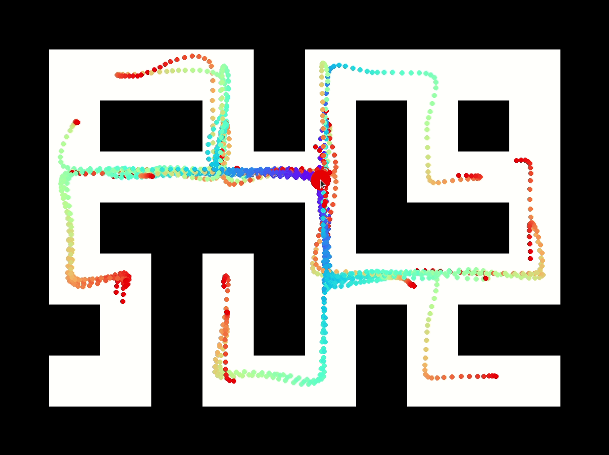
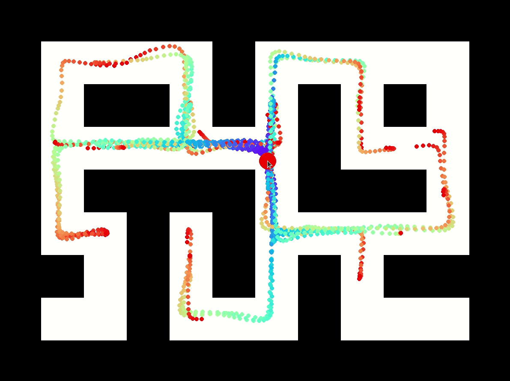

# Inference-Time Policy Steering (ITPS)

Maze2D benchmark of various sampling methods with sketch input from the paper [Inference-Time Policy Steering through Human Interactions](https://yanweiw.github.io/itps/).

## Installation 
Clone this repo
```
git clone git@github.com:yanweiw/itps.git
cd itps
```
Create a virtual environment with Python 3.10
```
conda create -y -n itps python=3.10
conda activate itps
```
Install ITPS
```
pip install -e .
```
Download the pre-trained weights for [Action Chunking Transformers](https://drive.google.com/file/d/1kKt__yQpXOzgAGFvfGpBWdtWX_QxWsVK/view?usp=sharing) and [Diffusion Policy](https://drive.google.com/file/d/1efez47zfkXl7HgGDSzW-tagdcPj1p8z2/view?usp=sharing) and put them in the `itps/itps` folder (Be sure to unzip the downloaded zip file).

## Visualize pre-trained policies. 

Run ACT or DP unconditionally to explore motion manifolds learned by these pre-trained policies.
```
python interact_maze2d.py -p [act, dp] -u
```
|Multimodal predictions of DP|
|---------------------------|
||


## Bias sampling with sketch interaction. 

`-ph` - Post-Hoc Ranking
`-op` - Output Perturbation
`-bi` - Biased Initialization
`-gd` - Guided Diffusion
`-ss` - Stochastic Sampling
```
python interact_maze2d.py -p [act, dp] [-ph, -bi, -gd, -ss]
```
|Post-Hoc Ranking Example|
|---------------------------|
||
Draw by clicking and dragging the mouse. Re-initialize the agent (red) position by moving the mouse close to it without clicking. 

## Visualize sampling dynamics.

Run DP with BI, GD or SS with `-v` option.
```
python interact_maze2d.py -p [act, dp] [-bi, -gd, -ss] -v
```
| Stochastic Sampling Example|
|---------------------------|
||

## Benchmark methods.
Save sketches into a file `exp00.json` and use them across methods.
```
python interact_maze2d.py -p [act, dp] -s exp00.json
```
Visualize saved sketches by loading the saved file, press the key `n` for next. 
```
python interact_maze2d.py -p [act, dp] [-ph, -op, -bi, -gd, -ss] -l exp00.json
```
Save experiments into `exp00_dp_gd.json`
```
python interact_maze2d.py -p dp -gd -l exp00.json -s .json
```
Replay experiments.
```
python interact_maze2d.py -l exp00_dp_gd.json
```

## How to get the pre-trained policy?
While the ITPS framework assumes the pre-trained policy is given, I have received many requests to open source my training data [(D4RL Maze2D)](https://github.com/Farama-Foundation/D4RL/blob/89141a689b0353b0dac3da5cba60da4b1b16254d/d4rl/infos.py#L11) and training code [(my LeRobot fork)](https://github.com/yanweiw/lerobot/blob/custom_dataset/lerobot/scripts/train.py) (use it at your own risk as it is not as well-maintained as the inference code in this repo). So here you are: 

Make sure you are on the `custom_dataset` branch of the training codebase and use the [dataset here](https://drive.google.com/file/d/1UPdjg48e9WFs6j_GTmF2xUJPV_XNMiUk/view?usp=sharing).
```
python lerobot/scripts/train.py policy=maze2d_act env=maze2d
```
You can set `policy=maze2d_dp` to train a diffusion policy. If the `itps` conda environment does not support training, create a `lerobot` environment [following this](https://github.com/yanweiw/lerobot/tree/custom_dataset). Hopefully, this will work. But I cannot guarantee it, as this is not the paper contribution and I am not maintaining it. 

## Acknowledgement

Part of the codebase is modified from [LeRobot](https://github.com/huggingface/lerobot).
